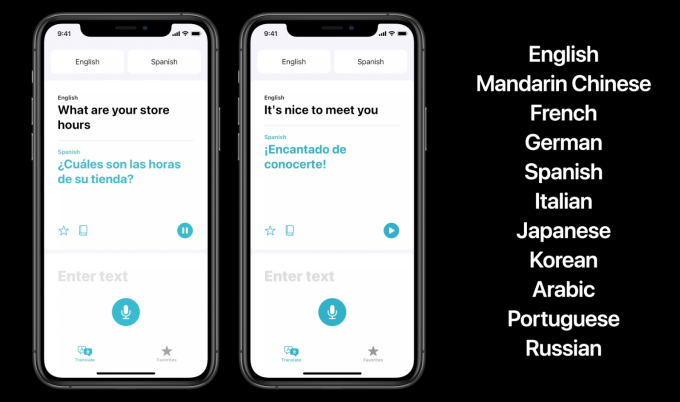

# PY_Speech_Translator

## Inspiration For Project


<image_description>
<p style="font-style: italic"> Figure 1. Diagram showing current Apple speech translator

<a href="https://techcrunch.com/2020/06/22/apples-new-translate-app-works-offline-with-11-languages/" >Source Of Image</a> 

</p>
</image_description>

<body1>
<p> When using the Apple speech translator one day, I noticed that the number of languages available to translate is limited. I considered building a simple Python code to do the same thing as the Apple translator but to include more languages, such as Hindi, German, Telugu, and many more (specified in language.tex). The basic idea relies on asking the user to say something, picking up what they say, and converting it to text via a speech recognition library. Take that text and use the Google Translate library to translate it to the language of the user's choice, then use gTTs to take that translated text and speak it back to the user. Based on this framework, I designed the code</p>
</body1>

## How To Use Speech Translator

To begin, you must clone the repo or download the zip file.

```shell
git clone https://github.com/Hanbrar/PY_Speech_Translator.git
```

Next, you need to install all the necessary dependencies by running the command below:

```shell
pip install -r requirements.txt
```

After completing these two steps, follow what is specific in the top section in the languageconverter.py to understand how to pick and update the language you want to translate your speech to.

Then go to the terminal and run the following command to run the python file:

```shell
python languageconverter.py

# or

python3 languageconverter.py
```
Then, you will see in the terminal "Working," which means speak what you want to be translated into the language of your choice. An example of usage is below converting from English to Japanese.

```shell
$ python languageconverter.py
Working
Done
Recognized Text:
hello how has your day been
こんにちはあなたの一日はどうでしたか
Working
Done
Recognized Text:
okay well I will see you tomorrow bye
さて、明日さようならお会いしましょう
```
## Development Notes

The development of code relied on the following sources: 
<a href="https://pypi.org/project/SpeechRecognition/"> SpeechRecognition Library </a>
,
<a href="https://pypi.org/project/gTTS/">gTTS Library</a>
,
<a href="https://www.geeksforgeeks.org/play-sound-in-python/"> Guide to playing audio files</a> , <a href="https://pypi.org/project/googletrans/"> googletrans Library</a>.

These helped me immensely in developing this code efficiently. I also learned about try and except statements better through this project as I had to handle two types of error: one related to failure due to no audio detection and one related to inability to play the audio file. 

I hope you like my project!

## Note
When running, Apple may ask for your permission to access the microphone for recording. To use this code, you must grant permission by saying "yes." You may also see a similar prompt if you want to enable VS Code to access your files and folders. It is essential to grant this permission as the OS library is used to delete and reappear MP3 files containing text-to-speech output. Without this permission, the translator will not work. 